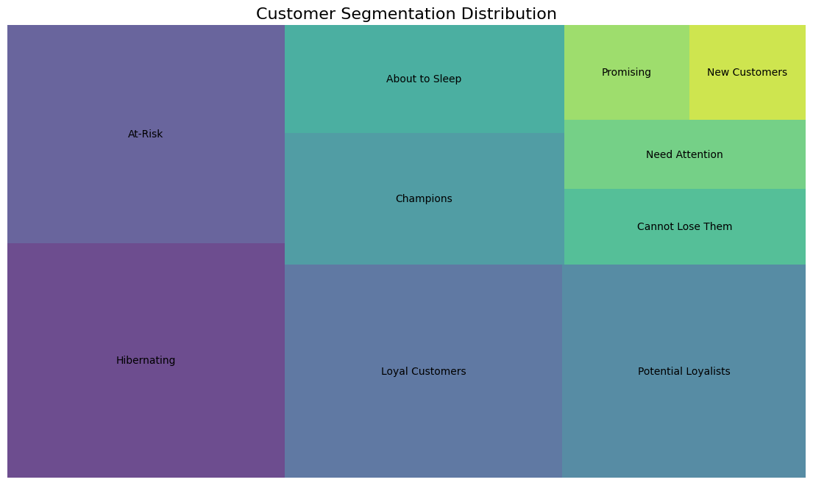

# Customer Segmentation using RFM Analysis

## Project Overview

This project performs a customer segmentation analysis on a transactional dataset using the RFM (Recency, Frequency, Monetary) model. The goal is to categorize customers into distinct groups based on their purchasing behavior, enabling the business to develop targeted and effective marketing strategies.

The analysis involves several key stages:
1.  **Data Cleaning and Exploration:** Loading the raw data, handling missing values, duplicates, and data type errors.
2.  **RFM Calculation:** Computing the Recency, Frequency, and Monetary value for each customer.
3.  **Segmentation:** Scoring customers based on their RFM values and grouping them into meaningful segments such as 'Champions', 'Loyal Customers', and 'At-Risk'.
4.  **Analysis and Strategy:** Analyzing the characteristics of each segment and proposing data-driven marketing recommendations.

---

## Project Structure

The repository is organized as follows:

```
customer_segmentation_rfm/
│
├── 📂 data/
│   ├── 📄 raw_data.csv             # Original, untouched transactional data
│   └── 📄 processed_data.csv       # Cleaned data ready for analysis
│   └── 📄 rfm_segmented_data.csv   # Final data with RFM scores and segments
│
├── 📂 notebooks/
│   ├── 📝 01_data_exploration.ipynb  # Initial data cleaning and EDA
│   ├── 📝 02_rfm_calculation.ipynb   # RFM metric calculation and scoring
│   └── 📝 03_segmentation_analysis.ipynb # In-depth segment analysis and visualization
│
├── 📂 reports/
│   ├── 📊 figures/                 # Charts and visualizations
│   │   └── 📈 customer_segmentation_distribution.png
│   └── 📄 project_roadmap.md       # Project plan and timeline
│
├── 📂 scripts/
│   └── 🐍 utils.py                 # Helper functions for the analysis pipeline
│
└── 📄 requirements.txt             # Required Python packages
└── 📄 README.md                    # This project overview
```

---

## How to Run

To replicate this analysis, follow these steps:

**1. Clone the repository:**
```bash
git clone <repository-url>
cd customer_segmentation_rfm
```

**2. Create and activate a virtual environment:**
```bash
python -m venv venv
source venv/bin/activate  # On Windows, use `venv\Scripts\activate`
```

**3. Install the required dependencies:**
```bash
pip install -r requirements.txt
```

**4. Run the Jupyter Notebooks:**
Open the notebooks in the `notebooks/` directory and run them in the following order:
1.  `01_data_exploration.ipynb`
2.  `02_rfm_calculation.ipynb`
3.  `03_segmentation_analysis.ipynb`

---

## Methodology

The customer segmentation is based on the RFM model:

* **Recency (R):** How recently did the customer make a purchase? (Calculated as the number of days since the last purchase).
* **Frequency (F):** How often do they purchase? (Calculated as the total number of unique transactions).
* **Monetary (M):** How much do they spend? (Calculated as the sum of their total purchases).

Each customer is assigned a score from 1 to 5 for each RFM metric. These scores are then combined to create detailed segments. For this analysis, we focused on Recency and Frequency scores to define actionable customer groups.

---

## Key Findings

The analysis identified several key customer segments, with the largest groups being lapsed or at-risk customers.

* **Key Insight 1: Largest Segments are Lapsed Customers.** Our biggest customer groups are **'Hibernating' (377)** and **'At-Risk' (350)**. This indicates a significant portion of our customer base is not actively purchasing, and a major business focus should be on re-engagement.

* **Key Insight 2: Champions Drive the Most Value.** While the **'Champions'** segment is not the largest (214 customers), they generate the **highest average revenue (£1928.8)** per customer. Retaining this group is critical for profitability.

* **Key Insight 3: High-Priority Recovery Opportunity.** The **'Cannot Lose Them'** segment is a crucial group to target. Despite not purchasing for a long time, they were our most frequent buyers. A successful win-back campaign for these 106 customers could yield significant revenue.

## Visualizations

### Customer Segment Distribution

The treemap below illustrates the size of each customer segment.


